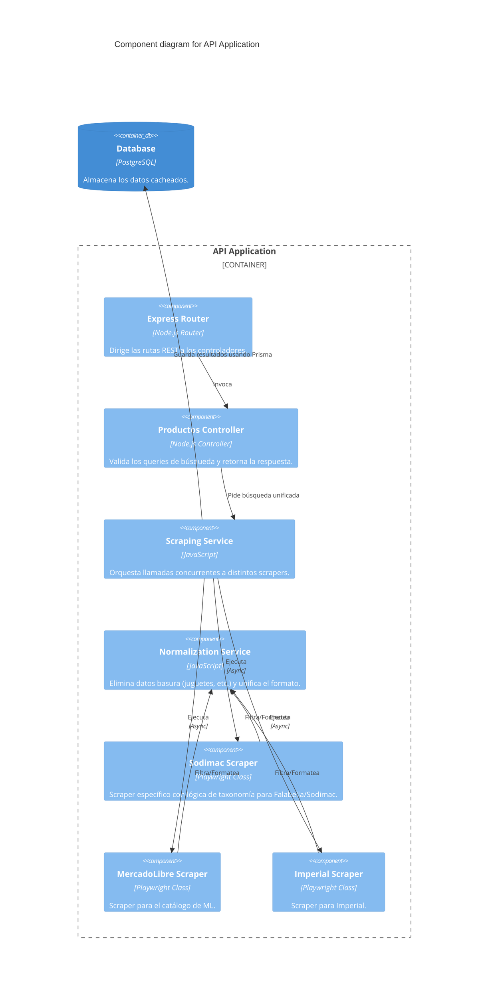

# C4 Component-Level Documentation

## 1. Component Diagram (API Application)

```mermaid
C4Component
    title Component diagram for API Application

    Container_Boundary(api, "API Application") {
        Component(router, "Express Router", "Node.js Router", "Dirige las rutas REST a los controladores.")
        Component(controller, "Productos Controller", "Node.js Controller", "Valida los queries de búsqueda y retorna la respuesta.")
        Component(scraping_service, "Scraping Service", "JavaScript", "Orquesta llamadas concurrentes a distintos scrapers.")
        Component(normalization_service, "Normalization Service", "JavaScript", "Elimina datos basura (juguetes, etc.) y unifica el formato.")
        Component(sodimac_scraper, "Sodimac Scraper", "Playwright Class", "Scraper específico con lógica de taxonomía para Falabella/Sodimac.")
        Component(ml_scraper, "MercadoLibre Scraper", "Playwright Class", "Scraper para el catálogo de ML.")
        Component(imperial_scraper, "Imperial Scraper", "Playwright Class", "Scraper para Imperial.")
    }

    ContainerDb(db, "Database", "PostgreSQL", "Almacena los datos cacheados.")

    Rel(router, controller, "Invoca")
    Rel(controller, scraping_service, "Pide búsqueda unificada")
    Rel(scraping_service, sodimac_scraper, "Ejecuta", "Async")
    Rel(scraping_service, ml_scraper, "Ejecuta", "Async")
    Rel(scraping_service, imperial_scraper, "Ejecuta", "Async")
    
    Rel(sodimac_scraper, normalization_service, "Filtra/Formatea")
    Rel(ml_scraper, normalization_service, "Filtra/Formatea")
    Rel(imperial_scraper, normalization_service, "Filtra/Formatea")

    Rel(scraping_service, db, "Guarda resultados usando Prisma")
```
