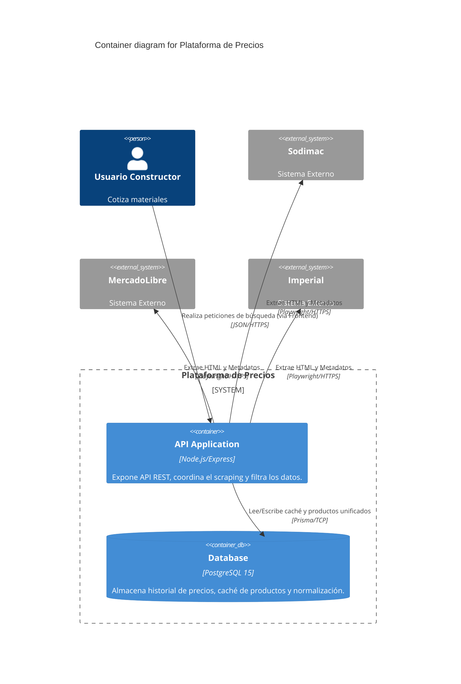

# C4 Container-Level Documentation

## 1. Containers
- **Name:** Node.js API (Backend)
  - **Type:** API REST / Orquestador de Web Scraping
  - **Technology:** Node.js, Express, Playwright
  - **Deployment:** Servidor Node nativo o contenedor Docker
- **Name:** Base de Datos PostgreSQL
  - **Type:** Database
  - **Technology:** PostgreSQL 15, Prisma ORM
  - **Deployment:** Contenedor Docker

## 2. Container Diagram

