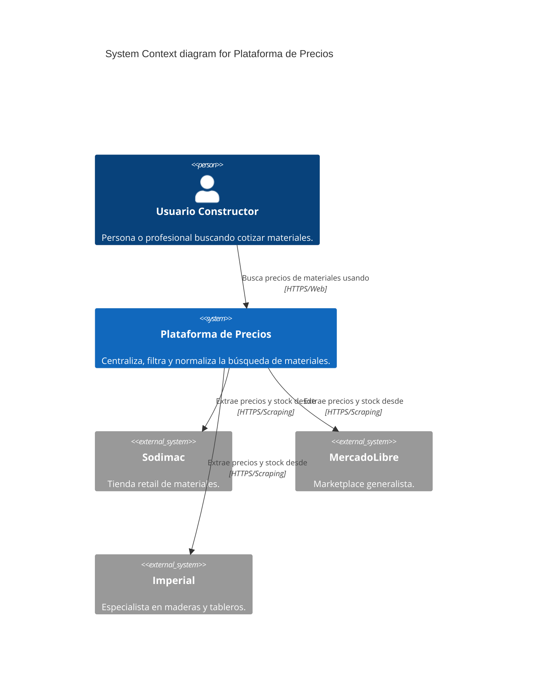

# C4 Context-Level Documentation

## 1. System Overview
**Name:** Plataforma de Precios
**Short Description:** Plataforma de búsqueda unificada para precios de materiales de construcción.
**Long Description:** Sistema que permite a los usuarios buscar, comparar y encontrar los mejores precios de materiales de construcción extrayendo datos en tiempo real (y mediante caché) de diversas tiendas minoristas como Sodimac, MercadoLibre e Imperial, centralizando y normalizando la información para evitar inconsistencias.

## 2. Personas
- **Usuario Final (Cotizador/Constructor):**
  - **Type:** Human User
  - **Description:** Profesional o persona natural que busca optimizar costos de materiales.
  - **Goals:** Encontrar el material más económico y con disponibilidad.
  - **Key features:** Búsqueda rápida, comparación de precios, filtros dinámicos.

## 3. System Features
- **Búsqueda Centralizada:** Consultar múltiples tiendas desde un único punto.
- **Filtrado Inteligente:** Ignora automáticamente resultados que no corresponden al rubro de la construcción.

## 4. User Journeys
- **Búsqueda Básica:**
  1. El usuario ingresa a la aplicación web.
  2. Ingresa un término (ej. "Taladro Bosch").
  3. El sistema consulta a la caché local o invoca scrapers en tiempo real.
  4. El sistema consolida y normaliza resultados.
  5. El usuario recibe un listado ordenado y depurado.

## 5. External Systems and Dependencies
- **Sodimac / Falabella (Web/API):**
  - **Type:** Tienda Minorista Externa.
  - **Description:** Proveedor principal de datos de construcción.
  - **Integration:** Web Scraping (Playwright).
- **MercadoLibre (Web/API):**
  - **Type:** Marketplace Externo.
  - **Integration:** Web Scraping (Playwright / REST fallback).
- **Imperial (Web):**
  - **Type:** Proveedor especializado en maderas y terminaciones.
  - **Integration:** Web Scraping.

## 6. System Context Diagram

